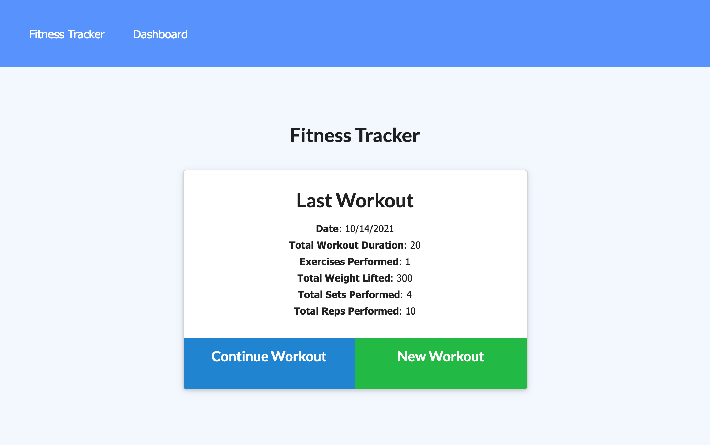
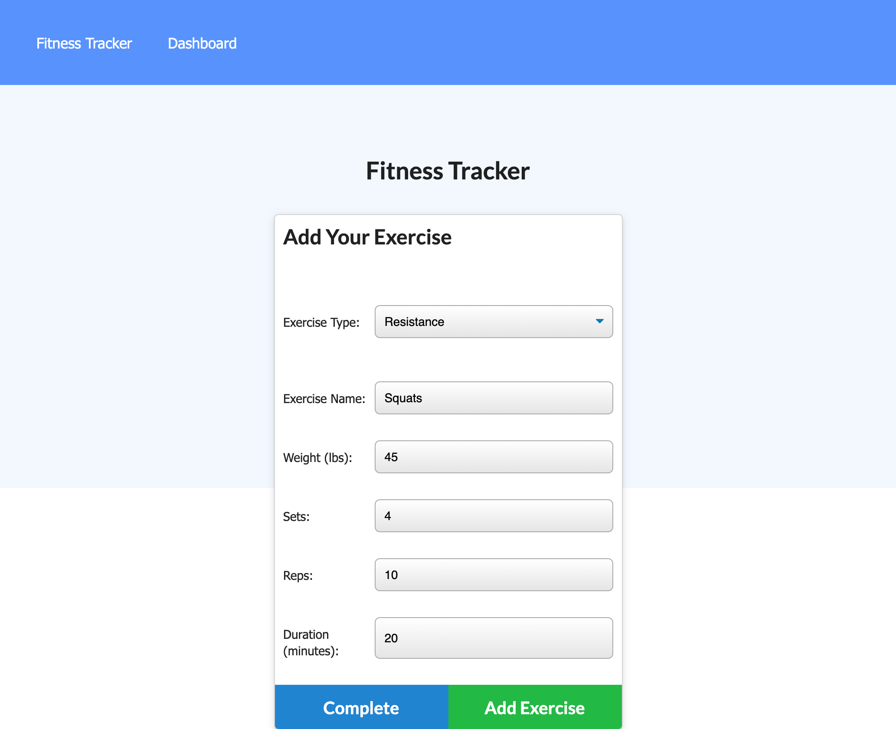
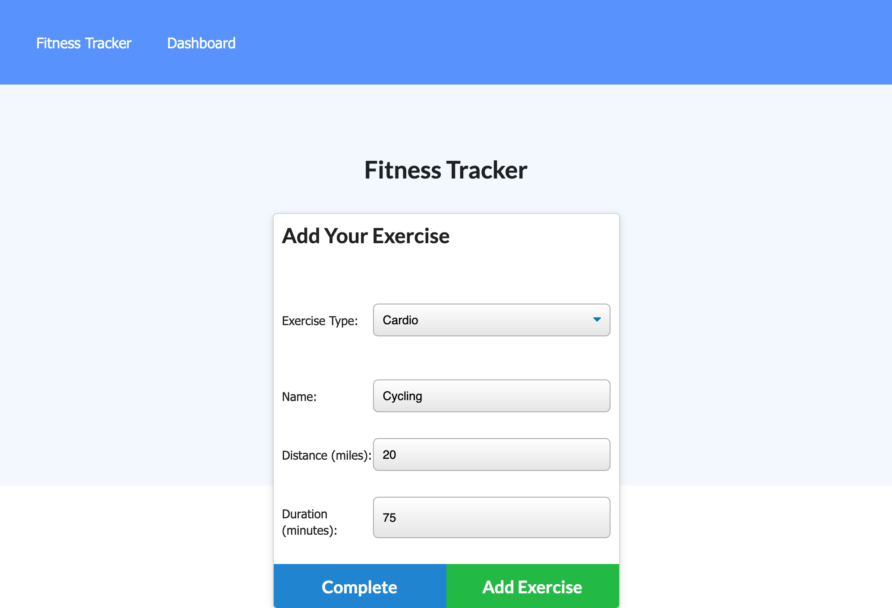
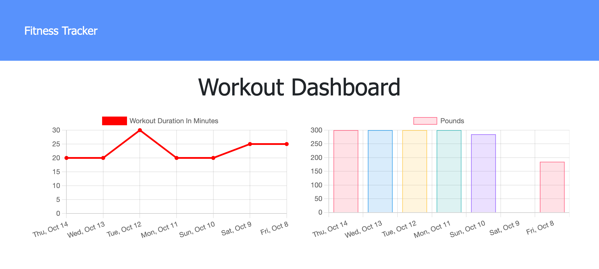

# 💪 Workout Tracker

This full stack application uses a [Mongo](https://www.mongodb.com/) database with [Mongoose](https://mongoosejs.com/) object modeling and an [Express](https://expressjs.com/) API to allow users to track daily workouts.

<!-- [See the deployed application here](TODO: Add link to the deployed application after deployment) -->

---

## Table of Contents
* [Technologies](#technologies)
* [Functionality](#functionality)
* [Challenges](#challenges)
* [Future Development](#future-development)
* [Contact](#contact)
* [License](#license)

## Technologies

&nbsp;
&nbsp;
&nbsp;
&nbsp;
&nbsp;
&nbsp;

## Functionality

<!-- TODO: Add screenshots/GIFs to show app functionality -->
### Application Landing Page

  

### Add Resistance Exercise

  

### Add Cardio Exercise

  

### Application Stats Page

  

## Challenges

<!-- TODO: Log challenges as they arise -->

## Future Development

<!-- TODO: Add ideas for future development as they arise -->

## Contact
Email me any time with questions, comments, or cat/dog photos! - ctbarrett.tech@gmail.com

## License
&copy; 2021 Charles Tucker Barrett

[MIT License](https://opensource.org/licenses/MIT)